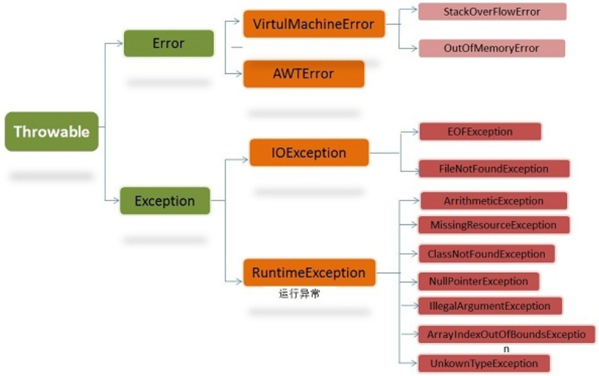

## Java异常类层次结构图

## Throwable类

在Java中，所有异常都有一个共同的祖先 java.lang 包下的 Throwable 类。Throwable有两个重要的子类：Exception(异常)和Error(错误)，二者都是Java异常处理的重要子类，各自都包含了大量子类。

**Throwable类常用方法：**
		public string getMessage()：返回异常时的详细信息。
		public string toString()：返回异常发生时的简要描述。
		public string getLocalizedMessage()：返回异常对象的本地化信息。使用Throwable的子类覆盖这个方法，可以声称本地化信息。如果子类没有覆盖该方法，则该方法给返回的信息与getMessage()返回的结果相同。
		public void printStackTrace()：在控制台打印Throwable对象封装的异常信息。

## Error

是程序无法处理的错误。

表示应用程序中较严重的问题。大多数错误与代码编写者执行无关，而表示代码运行时JVM出现的问题。例如，Java虚拟机运行错误（Virtual-MachineError），当JVM不再有继续执行操作所需的内存资源时，将出现OutOfMemoryError。这些异常发生时，Java虚拟机一般会选择线程终止。

这些错误表示故障发生在虚拟机自身、或者发生在虚拟机试图执行应用时，如Java虚拟机运行错误、类定义错误等。这些错误不可查的，因为它们在应用程序的控制和处理能力之外，而且绝大多数是程序运行时不允许出现的状况。对于设计合理的应用程序来说，即使确实发生了错误，本质上也不应该试图去处理它所引起的异常状况。在Java中，错误通过Error的子类描述。

## Exception

是程序本身可以处理的异常，包含了 checkedException 和 uncheckException。

Exception 类有一个重要的子类 RuntimeException。RuntimeException异常由JVM抛出。

**NullPointerException**（要访问的变量没有引用任何对象时，抛出该异常）、
**ArithmeticException**（算术运算异常，一个整数除以0时，抛出该异常）、 **ArrayIndexOutOfBoundsException**（下标越界异常）

## checked and unchecked

**uncheckedException：**

​		非检查性异常，不处理编译也能通过，如果有抛出会在控制台抛出

​		运行时异常就是非检查性异常

**checkedException：**

​		检查性异常，不处理编译不能通过

​		除了运行时异常都是检查性异常

## 异常处理总结

**try块：**
	用于捕获异常。其后可接零个或多个catch块，如果没有catch块，则必须跟一个finally块。

**catch块：**
	用于处理try捕获到的异常

**finally块：**
	无论是否捕获或处理异常，finally块里的语句都会被执行。当在try块或catch块中遇到return语句时，finally语句块将在方法返回之前被执行。

**finally块不会被执行的情况：**
	1.在finally语句块第一行发生了异常，finally块不会被执行。但是在其它行，finally还是会得到执行。
	2.在前面的代码中用了System.exit(int)退出程序。exit是带参函数。若该语句在异常语句之后，finally会执行。
	3.程序所在的线程死亡
	4.关闭CPU

