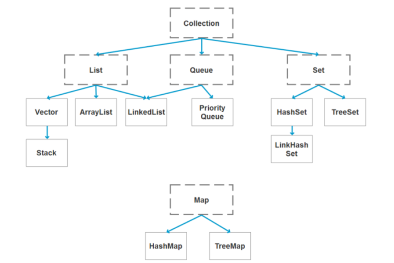

# 一、集合层次结构

Collection:
		List接口
				ArrayList（高并发下用CopyOnWriteArrayList）
				LinkedList
				Vector（线程安全）     Stack继承自Vector			
		Set接口
				HashSet      ->     LinkedHashSet
				TreeSet
		Queue接口
				LinkedList
				PriorityQueue

Map
		HashMap
		HashTable
		TreeMap
		LinkedHashMap

# 二、fail-fast原理

fail-fast 机制是 Java集合（Collection）中的错误机制。
可以理解成当多个线程对同一个集合的内容进行操作时，可能引起并发异常问题，而导致 fial-fast 事件。

## 解决方法：

fail-fast 机制，是一种错误检测机制。**它只能被用来检测错误，因为JDK并不保证 fail-fast 机制一定会发生**。若在多线程环境下使用 fial-fast 机制的集合，建议使用 “java.util.concurrent" 包下的类去取代 "java.util" 包下的类。

所以，本例中只需要将ArrayList替换成 java.util.concurrent 包下对应的类即可。
即将代码： private static List\<String> list = new AraayList\<String> ();
    替换为： private static List\<String> list = new CopyOnWriteArrayList\<String>();

## 原理见Java 集合系列04之 fail-fast总结

https://www.cnblogs.com/skywang12345/p/3308762.html

