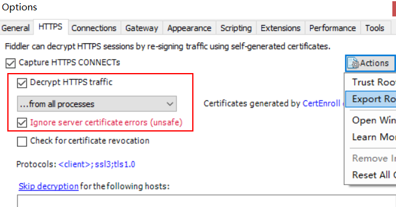

## 1.下载Fiddler、MuMu安卓模拟器

https://www.telerik.com/download/fiddler

默认安装即可

## 2.Fiddler配置

### 2.1 创建证书

Tools -> Options -> Https

### 2.2 开放 remote connect

Tools -> Options -> Connections

 

## 3.MuMu模拟器配置

### 3.1 安装证书

### 3.2 设置代理

ip为物理机的ip地址

## 4. 重启Fiddler

重启Fiddler后，便能抓取到mumu模拟器上运行的app的http请求包。选用Fiddler的好处是，能够清晰明了的看到，https请求的请求参数、返回的数据，方便后端开发调试，定位到具体的接口路径。